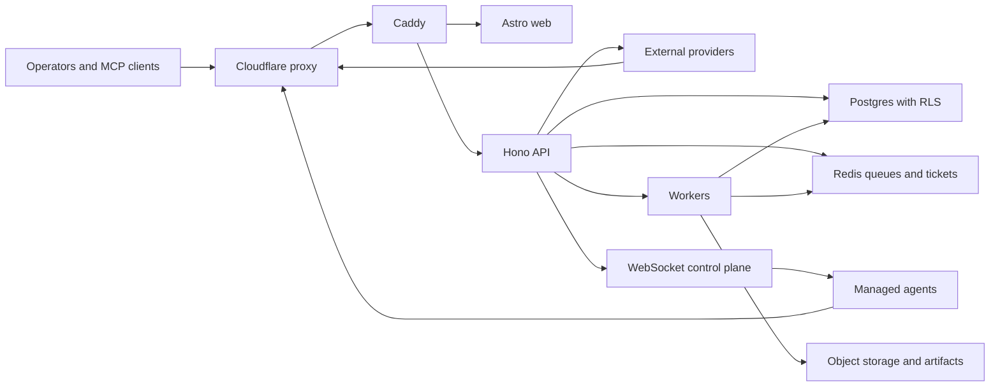

# Breeze RMM Threat Model

## Executive summary

Breeze is a high-trust, internet-exposed RMM platform: the most important risks are cross-tenant access, unauthorized remote control of managed devices, theft or misuse of bearer credentials, supply-chain compromise of agent/recovery artifacts, and abuse of the new OAuth/MCP automation surface. The strongest existing controls are JWT/API-key/agent-token auth, MFA on sensitive operator actions, RLS-backed tenant isolation, Zod validation, command and audit logging, webhook SSRF filtering, and production startup checks. The highest-priority review areas are the agent command/result control plane, enrollment, remote desktop/file/script execution, backup/recovery, OAuth/MCP, and any route that intentionally bypasses normal JWT middleware.

## Scope and assumptions

- In scope: full repo at `/Users/toddhebebrand/breeze`, with emphasis on `apps/api`, `apps/web`, `agent`, `packages/shared`, `docker-compose.yml`, Caddy config, migrations, workers, OAuth/MCP, RMM command/control, backup/recovery, and external integrations.
- Out of scope: tests and local dev tooling except where they affect production controls or supply chain; CI is considered only for release/artifact trust.
- Deployment context, user-confirmed: DigitalOcean droplet running Docker, Caddy, and Cloudflare proxy in front of the app.
- Production exposure: Caddy routes public HTTPS traffic to Astro web and Hono API; Postgres and Redis are private Docker services; TURN/WebRTC is optional.
- OAuth/MCP context, user-confirmed: OAuth/MCP is brand new and should be treated as production once these reviews are complete.
- Security sensitivity: high. Breeze stores and acts on MSP/customer tenant data, device inventory, scripts, file access, remote desktop/terminal, backup/restore state, OAuth tokens, AI tool actions, and audit logs.
- Open questions that could change risk ranking:
  - Whether Cloudflare Access/WAF rules restrict admin, MCP, agent, or recovery endpoints beyond the app controls.
  - Whether the droplet host, Docker socket, Redis, and Postgres are monitored and hardened as production assets.
  - Whether OAuth/MCP destructive tool allowlists will start narrow or broad at launch.
- Testing note for later:
  - Production config now rejects placeholder or short `AGENT_ENROLLMENT_SECRET` and `ENROLLMENT_KEY_PEPPER` values when configured; test deploy env uses at least 32 random characters, or deliberately leaves `AGENT_ENROLLMENT_SECRET` unset and verifies per-key enrollment secrets are present.
  - Test agent enrollment with valid key+secret, missing secret, invalid secret, expired/exhausted key, Redis unavailable, and repeated enrollment attempts through Cloudflare/Caddy so the source-IP rate limit uses the expected address.

## System model

### Primary components

- Reverse proxy and perimeter: Caddy exposes ports `80`/`443` and routes `/api/*`, `/oauth/*`, well-known OAuth routes, web UI, and health endpoints. Evidence: `docker-compose.yml`, `docker/Caddyfile.prod`.
- Web frontend: Astro + React server output, CSP configured in `apps/web/astro.config.mjs`.
- API server: Hono app mounts auth, agents, devices, scripts, remote access, tunnels, WebSockets, backup, OAuth, MCP, integrations, webhooks, AI, security, monitoring, and workers from `apps/api/src/index.ts`.
- Data stores: PostgreSQL via Drizzle and RLS session variables in `apps/api/src/db/index.ts`; Redis for rate limits, queues, WebSocket/session tickets, OAuth revocation, and workers.
- Managed agent: Go agent enrolls via `/api/v1/agents/enroll`, then uses bearer token auth for REST and WebSocket control-plane traffic. Evidence: `agent/pkg/api/client.go`, `apps/api/src/routes/agents/enrollment.ts`, `apps/api/src/middleware/agentAuth.ts`, `apps/api/src/routes/agentWs.ts`.
- Remote control plane: API queues commands and relays terminal, desktop, tunnel, file, script, backup, DR, and system-tool operations to agents. Evidence: `apps/api/src/services/commandQueue.ts`, `apps/api/src/routes/terminalWs.ts`, `apps/api/src/routes/desktopWs.ts`, `apps/api/src/routes/tunnelWs.ts`, `apps/api/src/routes/systemTools`.
- OAuth/MCP: flag-gated OIDC provider and MCP JSON-RPC/SSE server for external clients. Evidence: `apps/api/src/routes/oauth.ts`, `apps/api/src/oauth/provider.ts`, `apps/api/src/routes/oauthInteraction.ts`, `apps/api/src/routes/mcpServer.ts`.
- Workers: API initializes many background workers for alerts, discovery, patching, backup, DR, software, security posture, webhooks, and retention in `apps/api/src/index.ts`.

### Data flows and trust boundaries

- Internet -> Cloudflare -> Caddy -> Web/API
  - Data: browser sessions, API JSON, OAuth redirects, agent enrollment, agent telemetry, MCP JSON-RPC, recovery downloads, WebSockets.
  - Channel: HTTPS/WSS at the public edge.
  - Guarantees: Cloudflare proxy by deployment assumption; Caddy TLS/HSTS; API secure headers, CSP, CORS, body limits, global rate limits.
  - Validation: route-level Zod schemas, JWT/API-key/OAuth/agent auth, per-route permission checks.

- Operator browser -> API
  - Data: credentials, JWTs, refresh cookies, tenant-scoped RMM actions, scripts, files, remote sessions.
  - Channel: HTTPS JSON and WSS.
  - Guarantees: Argon2 password verification, JWT access/refresh tokens, MFA claim enforcement on sensitive routes, RBAC permissions, RLS DB context.
  - Validation: Hono middleware plus route schemas. Evidence: `apps/api/src/routes/auth/login.ts`, `apps/api/src/middleware/auth.ts`, `apps/api/src/services/jwt.ts`.

- Agent -> API
  - Data: enrollment key/secret, agent bearer token, telemetry, command results, desktop frames, terminal output, tunnel bytes.
  - Channel: HTTPS and WSS.
  - Guarantees: enrollment rate limit, enrollment key hashing, production enrollment secret requirement, SHA-256 token hash compare, per-agent rate limits, quarantined/decommissioned status checks.
  - Validation: Zod schemas for enrollment/heartbeat/results; authenticated DB context scoped to the device org. Evidence: `apps/api/src/routes/agents/schemas.ts`, `apps/api/src/middleware/agentAuth.ts`.

- API/workers -> Postgres
  - Data: tenant data, commands, OAuth grants/tokens, audit logs, agent state, backups, integrations.
  - Channel: internal Docker TCP.
  - Guarantees: application role intended via `DATABASE_URL_APP`; RLS session variables set in `withDbAccessContext`; migrations define org/partner policies.
  - Validation: Drizzle queries and RLS policies. Evidence: `apps/api/src/db/index.ts`, `apps/api/migrations`.

- API/workers -> Redis
  - Data: rate-limit counters, queues, session tickets, OAuth revocation markers, worker jobs.
  - Channel: internal Docker TCP.
  - Guarantees: compose requires Redis password; app fails closed in several production paths when Redis is unavailable.
  - Validation: job/schema validation is route/worker-specific. Evidence: `docker-compose.yml`, `apps/api/src/middleware/globalRateLimit.ts`, `apps/api/src/oauth/revocationCache.ts`.

- API -> external providers
  - Data: webhooks, S3/R2/Minio, email/SMTP/Resend, Anthropic, Microsoft 365/C2C, SentinelOne, Huntress, PSA, Cloudflare/TURN/signing services.
  - Channel: HTTPS or provider SDK/API.
  - Guarantees: encrypted stored secrets, webhook HTTPS/private-address filtering, provider-specific token handling.
  - Validation: URL safety checks, encrypted secret storage, route-specific schemas. Evidence: `apps/api/src/services/secretCrypto.ts`, `apps/api/src/services/notificationSenders/webhookSender.ts`.

- OAuth/MCP client -> OAuth provider -> MCP server
  - Data: DCR metadata, auth code, refresh token, JWT access token, MCP tool calls, SSE session IDs.
  - Channel: HTTPS JSON/redirects/SSE.
  - Guarantees: PKCE required, EdDSA JWTs, persisted sessions/grants, Redis revocation, OAuth bearer middleware, MCP scopes, tool tiers, production execute allowlist.
  - Validation: OIDC provider, resource indicator checks, grant metadata persistence, JSON-RPC validation, Zod tool input validation. Evidence: `apps/api/src/oauth/provider.ts`, `apps/api/src/middleware/bearerTokenAuth.ts`, `apps/api/src/routes/mcpServer.ts`.

#### Diagram

## Assets and security objectives

| Asset | Why it matters | Security objective (C/I/A) |
| --- | --- | --- |
| Tenant and partner data | MSP/customer boundary is a hard security property | C/I |
| User JWTs, refresh cookies, MFA state | Account takeover leads to RMM control | C/I |
| API keys and OAuth access/refresh tokens | External automation can read or mutate tenant state | C/I |
| Agent bearer tokens and enrollment keys/secrets | Device control-plane trust and rogue enrollment prevention | C/I |
| Remote command/script/file/desktop/tunnel state | Direct privileged control of customer endpoints | I/A/C |
| Backup, restore, DR, and recovery artifacts | Often contain full-system sensitive data and recovery authority | C/I/A |
| Webhook/integration secrets | Can expose customer SaaS, alerting, and automation channels | C/I |
| Redis queues, tickets, and revocation markers | Drives command dispatch, auth revocation, and worker behavior | I/A |
| Audit logs | Incident response and customer accountability | I/A |
| Agent/helper/viewer binaries and boot media | Supply-chain and endpoint execution trust | I |

## Attacker model

### Capabilities

- Unauthenticated internet attacker can reach public web/API routes exposed through Cloudflare/Caddy, including auth, enrollment, OAuth, MCP bootstrap when enabled, health, short links, callbacks, and WebSockets.
- Authenticated tenant user can probe for IDOR, RBAC, and tenant isolation failures.
- Partner-scoped technician/admin can access multiple orgs and may attempt cross-org or overprivileged actions.
- Compromised API key or OAuth grant can automate MCP/tool/resource access according to its scopes.
- Compromised managed endpoint can use a valid agent token to submit telemetry/results and receive commands for that device.
- Attacker with droplet or container compromise can target Redis, Postgres, local volumes, binaries, and worker queues.
- Malicious external webhook/provider endpoint can influence SSRF, callbacks, response bodies, retries, and stored delivery history.

### Non-capabilities

- A random internet attacker does not have JWT/API key/agent token material unless leaked.
- A compromised single agent token should not authorize other devices if route and WebSocket ownership checks hold.
- OAuth/MCP does not grant `ai:execute_admin` by default; destructive MCP tool execution is gated by scopes and production allowlist.
- Postgres and Redis are not intended to be directly internet-accessible in the Docker deployment.
- Cloudflare host/network controls are not assumed unless configured outside the repo.

## Entry points and attack surfaces

| Surface | How reached | Trust boundary | Notes | Evidence (repo path / symbol) |
| --- | --- | --- | --- | --- |
| Web UI | Browser via Caddy | Internet -> web | Astro SSR + React islands, CSP configured | `apps/web/astro.config.mjs` |
| API route hub | `/api/v1/*` | Internet -> API | Hono mounts large API surface | `apps/api/src/index.ts` |
| Auth login/refresh/MFA/password | `/api/v1/auth/*` | Internet -> identity | Public login/refresh plus authenticated account actions | `apps/api/src/routes/auth/login.ts`, `apps/api/src/routes/auth/mfa.ts` |
| Agent enrollment | `POST /api/v1/agents/enroll` | Internet -> device trust | Issues agent ID/token and optional mTLS material | `apps/api/src/routes/agents/enrollment.ts` |
| Agent REST | `/api/v1/agents/:id/*` | Agent -> API | Bearer-token device telemetry/results | `apps/api/src/middleware/agentAuth.ts` |
| Agent WebSocket | `/api/v1/agent-ws/:id/ws` | Agent -> API WS | Token-authenticated command/result channel | `apps/api/src/routes/agentWs.ts` |
| Remote terminal/desktop/tunnel WS | `/remote/sessions`, `/desktop-ws`, `/tunnel-ws` | Browser -> API WS -> agent | One-time tickets and session ownership checks | `apps/api/src/services/remoteSessionAuth.ts`, `apps/api/src/routes/terminalWs.ts` |
| System tools/file browser | `/api/v1/system-tools/*` | Operator -> endpoint command | File, registry, process, services, event log operations | `apps/api/src/routes/systemTools/index.ts` |
| Scripts and AI tools | `/api/v1/scripts`, `/api/v1/ai`, `/api/v1/mcp` | Operator/MCP -> command queue | Script creation/execution, AI/MCP tool dispatch | `apps/api/src/routes/scripts.ts`, `apps/api/src/services/aiGuardrails.ts`, `apps/api/src/routes/mcpServer.ts` |
| Backup/recovery/DR | `/api/v1/backup`, `/api/v1/dr` | Operator/recovery helper -> data plane | Backup artifacts and restore operations | `apps/api/src/routes/backup`, `apps/api/src/routes/dr.ts` |
| OAuth provider | `/oauth/*`, `/.well-known/*` | OAuth client/browser -> API | DCR, authorize, token, revocation, JWKS | `apps/api/src/routes/oauth.ts`, `apps/api/src/oauth/provider.ts` |
| OAuth consent/connected apps | `/api/v1/oauth/interaction/*`, `/api/v1/settings/connected-apps` | Browser/JWT -> OAuth grant | Consent, grant metadata, connected app revoke | `apps/api/src/routes/oauthInteraction.ts`, `apps/api/src/routes/connectedApps.ts` |
| MCP bootstrap | `/api/v1/mcp/message` without key when enabled | Unauth client -> tenant bootstrap | Limited unauth tenant/payment/bootstrap tools | `apps/api/src/routes/mcpServer.ts`, `apps/api/src/modules/mcpBootstrap/index.ts` |
| Webhooks | `/api/v1/webhooks` and worker delivery | Tenant admin -> external URL | Outbound HTTP to tenant-configured URLs | `apps/api/src/routes/webhooks.ts`, `apps/api/src/services/notificationSenders/webhookSender.ts` |
| External callbacks/integrations | C2C, M365 callback, PSA, SentinelOne, Huntress | Provider -> API | Provider OAuth/callback and sync surfaces | `apps/api/src/routes/c2c`, `apps/api/src/routes/sentinelOne.ts`, `apps/api/src/routes/huntress.ts` |

## Top abuse paths

1. **Cross-tenant data access:** attacker with a valid user/API/OAuth token finds a route that trusts `orgId` from query/body instead of `auth.canAccessOrg`/RLS -> reads or mutates another customer’s devices, scripts, backups, or integrations.
2. **Rogue agent enrollment:** attacker obtains enrollment key plus global/per-key secret -> enrolls a device into a tenant -> receives an agent token -> participates in command/control and telemetry for that org.
3. **Compromised agent result forgery:** attacker controls one endpoint or token -> submits crafted command results over REST/WebSocket -> poisons backup/DR/security state or marks privileged operations as complete.
4. **Remote-control privilege abuse:** compromised operator account/API key/OAuth grant with execute permissions -> launches script/file/terminal/desktop/tunnel actions -> exfiltrates files or changes endpoint state.
5. **MCP destructive-tool overreach:** OAuth/MCP client receives broad write/execute scopes and production allowlist includes dangerous tools -> external assistant runs state-changing RMM actions without interactive approval.
6. **OAuth grant/token persistence abuse:** attacker steals refresh token/client metadata or exploits revocation gaps -> continues MCP access after connected app deletion or user intent to revoke.
7. **Webhook SSRF or response poisoning:** tenant admin or compromised account configures malicious URL/headers -> app worker sends tenant data or records attacker-controlled response bodies; DNS rebinding/private resolution bypass would raise severity.
8. **Redis/worker trust compromise:** attacker compromises droplet/container/Redis -> mutates queues, session tickets, or revocation markers -> drives privileged worker actions or availability failures.
9. **Artifact supply-chain compromise:** attacker tampers with agent/helper/viewer binaries or recovery media inputs -> operators deploy trusted-looking malicious code to endpoints.
10. **Backup/recovery token exfiltration:** leaked recovery token or artifact descriptor -> attacker downloads sensitive backups or manipulates recovery state within token scope.

## Threat model table

| Threat ID | Threat source | Prerequisites | Threat action | Impact | Impacted assets | Existing controls (evidence) | Gaps | Recommended mitigations | Detection ideas | Likelihood | Impact severity | Priority |
| --- | --- | --- | --- | --- | --- | --- | --- | --- | --- | --- | --- | --- |
| TM-001 | Authenticated tenant/partner user or compromised token | Valid auth context and route with missing explicit org check or RLS coverage | Read/write data outside authorized org/partner | Cross-customer breach and tenant integrity loss | Tenant data, devices, backups, scripts, integrations | Auth context computes `accessibleOrgIds` and `orgCondition`; DB context sets `breeze.*` RLS GUCs; migrations define many org/partner policies | Large route surface means regression risk; some system-scope wrappers intentionally bypass RLS | Keep adding route-level multi-tenant tests for every new route; require security review for any `withSystemDbAccessContext`; run RLS coverage checks before deploy | Alert on 403/404 org mismatches, anomalous partner-wide reads, system-scope write paths | medium | high | high |
| TM-002 | External attacker with leaked enrollment material | Valid enrollment key and matching per-key/global secret | Enroll rogue agent and receive device token | Unauthorized device trust and command/result foothold in target org | Enrollment secrets, enrollment-key hashes, agent tokens, device records | Enrollment keys are peppered and hashed; expiry/max-use enforced; production blocks enrollment without a secret; production startup rejects placeholder or short `AGENT_ENROLLMENT_SECRET` and `ENROLLMENT_KEY_PEPPER`; rate limit/audit in enrollment route | Global secret creates broad blast radius if leaked; no device attestation or approval by default | Prefer per-key secrets and short-lived installer links; alert/approval for new devices in sensitive tenants; rotate global secret after exposure | Enrollment spike, unusual IP/geo, repeated invalid key/secret failures, config validation failures for weak enrollment secrets/peppers | medium | high | high |
| TM-003 | Compromised endpoint or stolen agent token | Valid agent token for one device | Submit forged telemetry/results or consume commands | False security/backup/DR state, command integrity compromise for one device | Command results, device state, backup/DR jobs | Token hash/timing-safe compare; decommission/quarantine checks; per-agent rate limits; command-result schemas and ownership checks in WebSocket paths | Agent is still trusted to report truth; validation depth varies by command family | Expand strict result schemas and expected-command reconciliation for all critical commands; bind result to claimed command/device/org consistently | Unexpected command/result timing, result from new IP, mismatched command IDs, repeated validation rejection | medium | high | high |
| TM-004 | Compromised operator/API key/OAuth grant | Permission to execute device operations | Run scripts, file writes, registry/service/process changes, terminal/desktop/tunnel sessions | Endpoint takeover, data exfiltration, ransomware-like impact | Managed endpoints, customer files, credentials | RBAC, MFA for sensitive user routes, remote access policy checks, one-time WS tickets, audit logging, command queue; production MCP tier-3 calls now require `ai:execute_admin` by default | MCP path can still auto-execute tier-3 tools when the caller has admin execute scope and the tool is allowlisted; user approval is UI-only | Keep MCP execute allowlist minimal; avoid setting `MCP_REQUIRE_EXECUTE_ADMIN=false` in production; separate human approval for highest-risk MCP actions | Audit tier-3 tool use, scripts/file downloads, desktop/tunnel sessions, unusual command bursts | medium | critical | critical |
| TM-005 | OAuth/MCP client, stolen OAuth token, malicious DCR client | OAuth/MCP enabled in production | Obtain broad MCP scopes, retain refresh token, or exploit tenant metadata gaps | External long-lived automation over RMM operations | OAuth tokens, API keys, MCP tools, tenant data | PKCE required; JWT access TTL 10m; new refresh tokens expire after 14 days; revoked refresh-token lookups emit `OAUTH_REFRESH_TOKEN_REUSE`; persisted sessions/grants; grant metadata fail-closed; consent body validation and membership checks; revocation cache checks; connected-app deletion revokes refresh tokens/grants and disabled clients are omitted from settings; revocation writes and startup now fail closed when OAuth is enabled but Redis is missing; OAuth `mcp:write` and `mcp:execute` are now distinct; `/oauth/reg` pre-validates and narrows DCR to public PKCE auth-code clients and now defaults off in production unless `OAUTH_DCR_ENABLED=true`; `/oauth/token` is rate-limited by IP and client through the trusted client-IP helper; MCP session/message limits use stable OAuth grant IDs instead of rotating access-token JTIs; MCP JSON-RPC bodies are capped at 64 KiB; bootstrap create/verify/attach-payment tools are rate-limited and follow-on bootstrap tools require the one-time `bootstrap_secret` from `create_tenant` | DCR clients are public if `OAUTH_DCR_ENABLED=true`; execute-capable clients still need clear consent UX and a narrow production allowlist | See `oauth-mcp-threat-model.md`; launch with narrow scopes/allowlist, monitor DCR/bootstrap usage, keep Redis SLO high, add abuse-rate limits per client/user | DCR disabled responses/spikes/rejections, token/revocation errors, connected app delete failures, refresh-token reuse logs, tier-3 tool calls by OAuth actors, bootstrap invalid-secret/rate-limit errors, MCP 413s | medium | high | high |
| TM-006 | External webhook target or compromised tenant admin | Webhook feature enabled and admin permission | Configure URL/headers to exfiltrate data or reach internal services | SSRF, alert payload exfiltration, stored response poisoning | Webhook payloads, internal metadata, delivery logs | HTTPS-only webhook URLs; localhost/private IP/DNS resolution blocks; secrets encrypted; MFA required for create/update/test | DNS rebinding and proxy edge cases still worth testing; response bodies are stored | Re-resolve DNS at send time, cap response body size, block redirects to private ranges, add allowlist option for high-security tenants | Webhook failures, blocked URL validation, internal/private DNS attempts, large response bodies | low | medium | medium |
| TM-007 | Droplet/container/Redis attacker | Host/container escape or Redis credential exposure | Mutate queues, tickets, OAuth revocation markers, rate limits | Privileged worker action, auth/revocation failure, availability loss | Redis queues, tickets, worker jobs, OAuth revocation | Redis password required in compose; many production paths fail closed if Redis missing; worker code validates some payloads | Redis is still a high-value single trust-zone component; no TLS or separate queue signing in compose | Restrict Redis to private Docker network, monitor auth failures, back up/alert on config drift, consider job signing for most privileged queues | Redis auth failures, queue producer anomalies, worker job mix changes, revocation read/write errors | low | high | medium |
| TM-008 | Supply-chain attacker or host attacker | Artifact source or mounted binary volume tampered | Publish malicious agent/helper/viewer/recovery media | Compromise many managed endpoints or recovery hosts | Binaries, installers, recovery artifacts | Binary dirs mounted read-only into API; manifest/signing work exists for recovery artifacts; CI scanners documented | Full release provenance and runtime binary sync must stay enforced across agent/viewer/helper paths | Require pinned checksums/signatures for all runtime binary sync; verify before serving downloads; alert on binary version drift | Binary checksum mismatch, unexpected binary source/version, download volume spike | low | critical | high |
| TM-009 | External attacker with leaked recovery token | Valid unexpired recovery token | Download backups or manipulate recovery completion state | Sensitive data exfiltration or misleading recovery records | Backups, restore jobs, recovery tokens | Token hashing/expiry/rate limits and scoped download design in backup/recovery routes; audit events | Bearer token remains a high-value capability; no second factor | Shorten token TTL, bind recovery token to approved context when possible, require explicit regenerate/revoke UI | Public recovery auth/download/complete sequence anomalies, large download fanout | medium | high | high |
| TM-010 | Internet attacker or botnet | Public auth endpoints exposed | Credential stuffing, refresh abuse, MFA brute force | Account takeover or auth service DoS | User accounts, sessions, MFA | Login rate limit fails closed without Redis; generic auth errors; dummy password hash for timing parity; refresh CSRF checks | Cloudflare and app limits both need production tuning; SMS/TOTP attack telemetry needs review | Add Cloudflare rate rules for auth/MFA/refresh; alert on lockout patterns; require strong password policy and MFA | Login failures per email/IP, MFA failures, refresh rate limit, impossible travel | medium | high | high |

## Criticality calibration

- Critical: broad tenant breach, remote code/command execution across many endpoints, OAuth/MCP path that executes destructive RMM tools broadly, signed malicious artifact distribution, or backup exfiltration at scale.
  - Examples: MCP token with broad execute scope plus permissive allowlist; route-level org bypass for backups/devices; malicious agent binary served to customers.
- High: single-tenant or single-device compromise with sensitive data/control impact, leaked recovery token for one device, rogue enrollment into one org, stolen OAuth refresh token with write privileges.
  - Examples: forged command result for one device; recovery download token abuse; compromised API key with `ai:execute`.
- Medium: attacks requiring host/internal compromise, constrained SSRF, operational integrity downgrade, noisy DoS with bounded blast radius.
  - Examples: Redis tampering after container compromise; webhook URL bypass; legacy unsigned artifact usage.
- Low: informational leaks or issues requiring unlikely preconditions and producing little tenant/control impact.
  - Examples: non-sensitive health metadata leak; blocked invalid OAuth state probes.

## Focus paths for security review

| Path | Why it matters | Related Threat IDs |
| --- | --- | --- |
| `apps/api/src/index.ts` | Central route mounting, middleware order, public-vs-auth route boundaries, worker startup | TM-001, TM-004, TM-005 |
| `apps/api/src/middleware/auth.ts` | JWT auth, accessible org derivation, permission context, MFA claim enforcement | TM-001, TM-010 |
| `apps/api/src/db/index.ts` | RLS session variable control and system-scope bypass mechanism | TM-001 |
| `apps/api/migrations` | RLS policy coverage and tenant isolation enforcement | TM-001, TM-005 |
| `apps/api/src/routes/agents` | Enrollment, heartbeat, token rotation, agent telemetry, command results | TM-002, TM-003 |
| `apps/api/src/middleware/agentAuth.ts` | Agent token verification and device/org scoping | TM-002, TM-003 |
| `apps/api/src/routes/agentWs.ts` | Live command/result channel, orphan result handling, desktop/tunnel relays | TM-003, TM-004 |
| `apps/api/src/services/commandQueue.ts` | Privileged command creation, audit logging, dispatch paths | TM-003, TM-004 |
| `apps/api/src/routes/systemTools` | File, process, service, registry, event log operations against endpoints | TM-004 |
| `apps/api/src/routes/remote` | File transfer, session ownership, transfer storage, remote policy checks | TM-004 |
| `apps/api/src/routes/terminalWs.ts` | One-time ticket validation and terminal session relay | TM-004 |
| `apps/api/src/routes/desktopWs.ts` | Viewer tokens, desktop control, frame/input validation | TM-004 |
| `apps/api/src/routes/tunnelWs.ts` | Tunnel ownership and binary relay between browser and agent | TM-004 |
| `apps/api/src/routes/scripts.ts` | Script storage/execution and multi-device dispatch | TM-004 |
| `apps/api/src/services/aiGuardrails.ts` | AI/MCP tool tiering, RBAC, rate limits, approval assumptions | TM-004, TM-005 |
| `apps/api/src/routes/mcpServer.ts` | MCP auth, bootstrap carve-out, scopes, SSE/session handling, tool dispatch | TM-004, TM-005 |
| `apps/api/src/oauth` | OAuth provider, adapter, key handling, grant/session persistence, revocation | TM-005 |
| `apps/api/src/routes/oauth.ts` | OAuth rate limits, revocation pre-handler, provider bridge | TM-005 |
| `apps/api/src/services/clientIp.ts` | Trusted proxy-header handling for auth/OAuth/MCP attribution and rate-limit keys | TM-005, TM-010 |
| `apps/api/src/routes/oauthInteraction.ts` | Consent flow, partner selection, grant metadata persistence | TM-005 |
| `apps/api/src/routes/connectedApps.ts` | Connected app deletion and revocation semantics | TM-005 |
| `apps/api/src/modules/mcpBootstrap` | Unauthenticated tenant bootstrap and payment-gated auth tools | TM-005 |
| `apps/api/src/oauth/keys.ts` | OAuth signing-key shape validation and public JWKS stripping | TM-005 |
| `apps/api/src/routes/webhooks.ts` | Webhook CRUD, MFA, encrypted secrets, test delivery | TM-006 |
| `apps/api/src/services/notificationSenders/webhookSender.ts` | SSRF validation and outbound HTTP behavior | TM-006 |
| `apps/api/src/jobs` | Queue consumers and privileged background actions | TM-007 |
| `apps/api/src/routes/backup` | Backup/recovery tokens, downloads, restore and DR operations | TM-009 |
| `apps/api/src/routes/dr.ts` | Disaster recovery orchestration and command paths | TM-009 |
| `apps/api/src/services/secretCrypto.ts` | Encryption-at-rest for integration/webhook/C2C secrets | TM-006, TM-005 |
| `docker-compose.yml` | Docker network, secret env, Redis/Postgres exposure, Caddy deployment | TM-007, TM-010 |
| `docker/Caddyfile.prod` | Public path routing, OAuth/API/web split, MCP SSE streaming, headers | TM-010, TM-005 |
| `agent` | Endpoint behavior, token storage, command execution, update paths | TM-003, TM-004, TM-008 |

## Quality check

- Covered discovered entry points: web, API, auth, agent REST/WS, remote WS, scripts/system tools, backup/recovery, OAuth/MCP, webhooks, integrations, workers, data stores, deployment perimeter.
- Covered each major trust boundary at least once in threats: internet perimeter, browser/API, agent/API, OAuth/MCP, API/Postgres, API/Redis, API/external providers, worker/artifact storage.
- Runtime vs CI/dev separation: report focuses on production runtime; CI/dev considered only for artifact/release trust.
- User clarifications reflected: full repo scope, DigitalOcean Docker + Caddy + Cloudflare deployment, OAuth/MCP considered production-bound.
- Assumptions and open questions explicit above.
